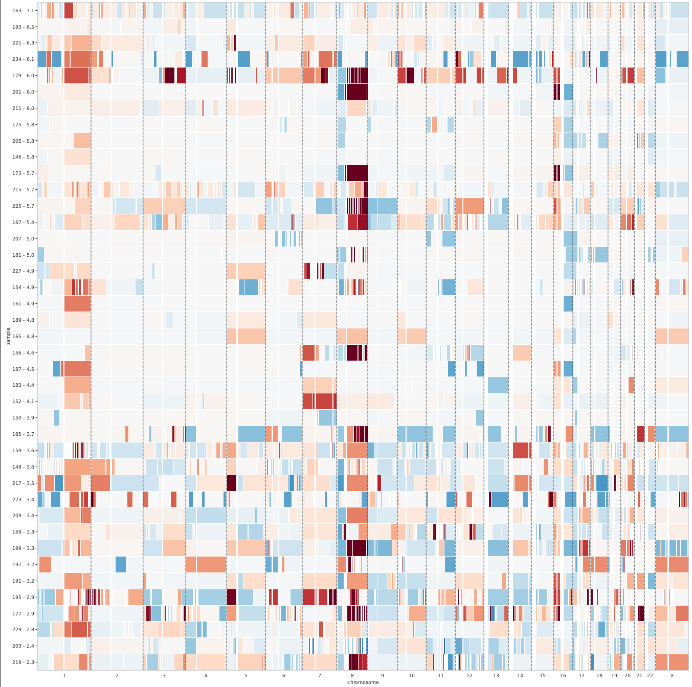
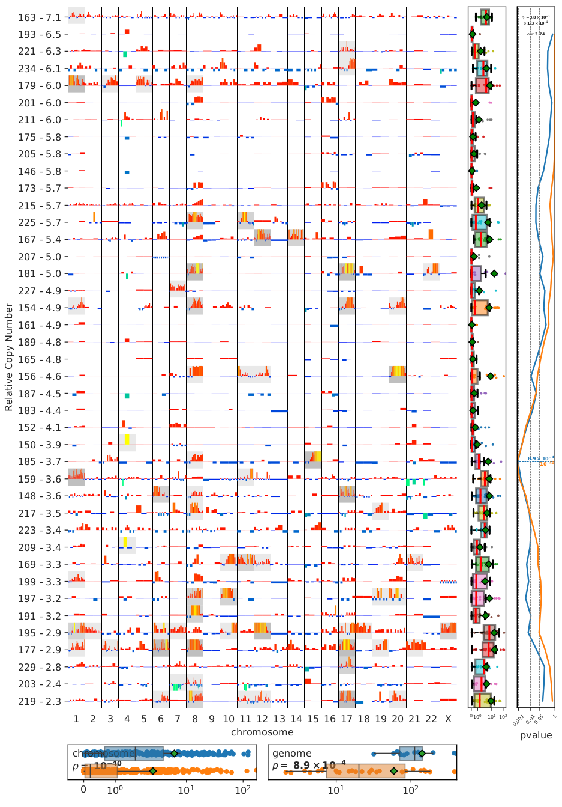
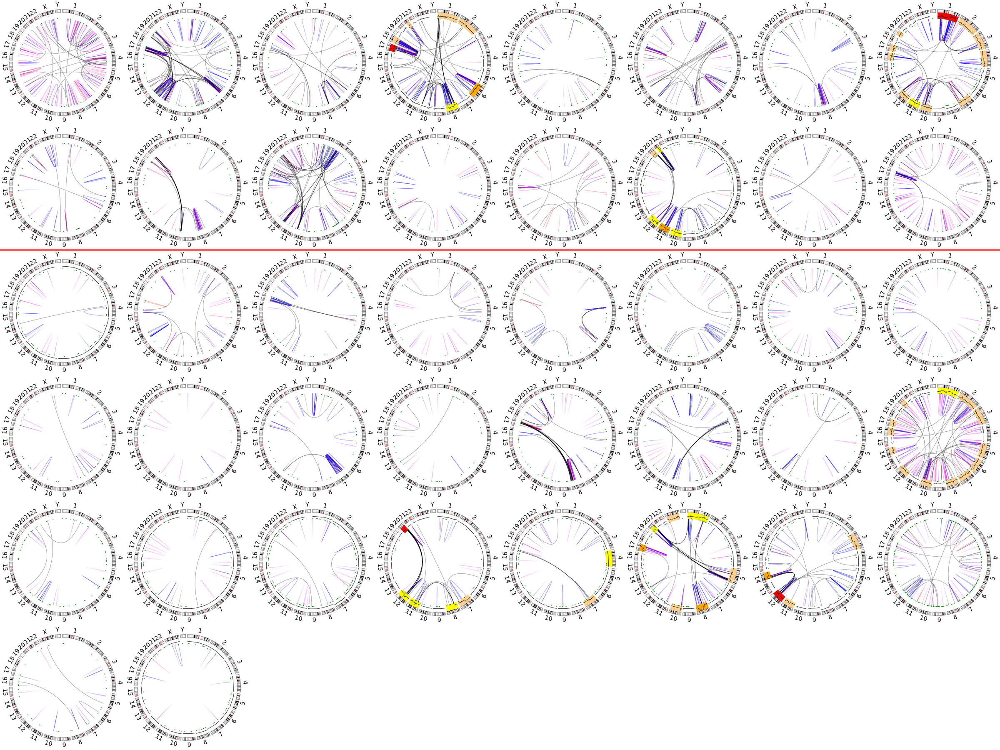
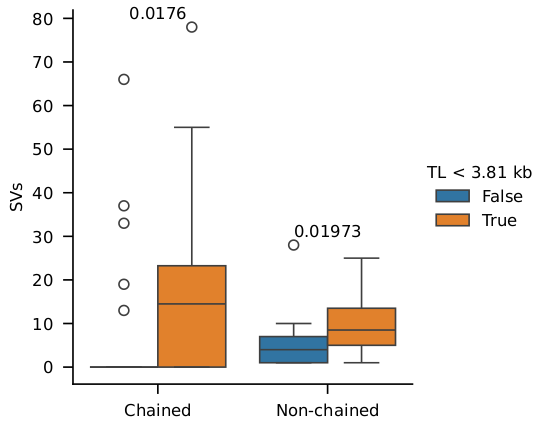
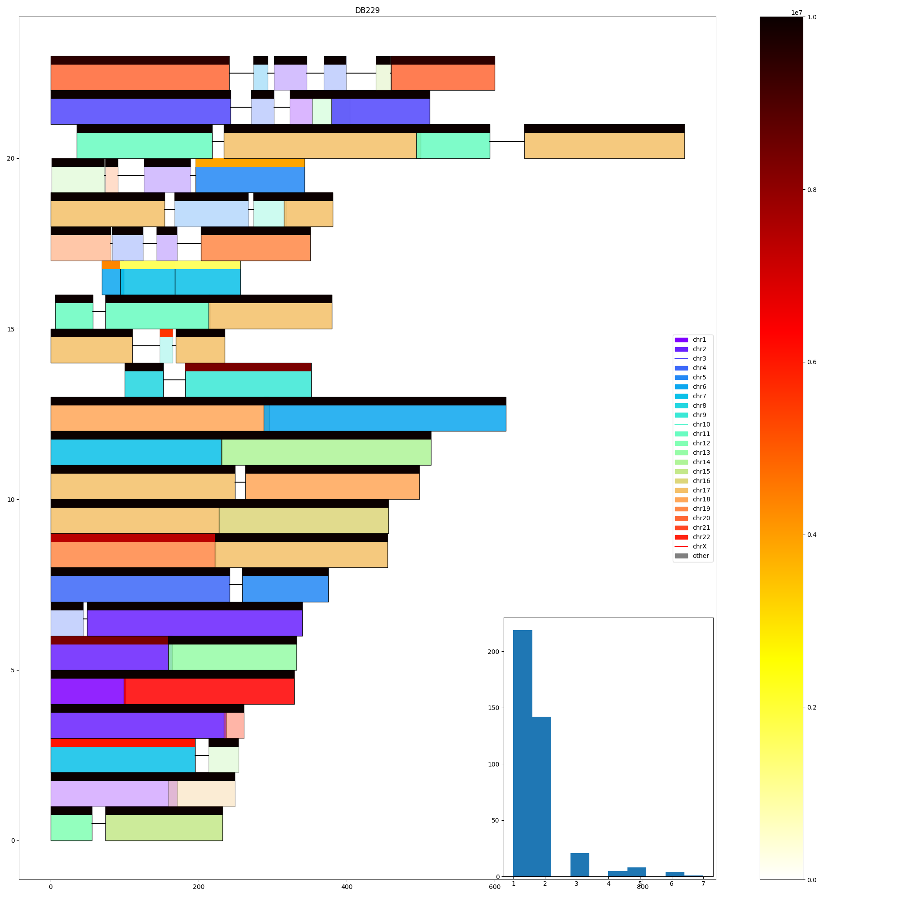

# dysgu-pipelines

This repo is a collection of scripts that can be used downstream of using the dysgu structural variant (SV) caller to analyse data. The scripts were written to analyse the affect of telomere length and genomic complexity, however telomere length can be substituted for any other variable.

The order recommended for running these pipelines is copy number, circos, chain link, RRAssembly, (scripts in the count folder does not impact further pipelines so can be run at any time).

These are collated as loose scripts as opposeed to a python module as they will probably require editting to fit your purpose. For example, they are set up to cover only hg38 and hg19 reference genomes, but can be adapted to fit others. For example in circos.py, to allow for the plotting of other genomes the line:

```
100  order_of_chr = [f"{i}" for i in range (1, 23)] + ["X", "Y"]
```
will have to be editted to include the chromosomes of the desired reference (note that the chr prefix will be removed if present in the contig name). The lines above this one will also have to be changed to allow for gathering of contigs that contain an underscore.

## required file

Some of the pipelines will require a "background" file called sample_pairs.csv, this file simply contains the sample names for the tumour, normal, and value to order them (which can be set to a constant if not required). The scripts that use this file will also require giving the column names. Within the scripts, you will see references to "telomere length", "stela", and "short/long" groups. These can all be changed to suit your own analysis.

# Basic Usage

More detailed instructions are shown in each directory for the analysis.

## Copy number

This is the only script that uses R, and requires installing the copynumber library. This can be done with:

```
R -e "install.packages('BiocManager')"
R -e "BiocManager::install('copynumber')"
```

Copy number can be obtained via the intermediary files generated by dysgu via the `coverage2bed.py` script (a coverage bed can be generated via any other method such as mosdepth or samtools depth).

```
# with run
dysgu run -v2 --metrics reference tmp_sample sample.bam -o sample.vcf 2> ${b}.log ; dysgu/coverage2bed.py –out-bin-size 10000 -w tmp_sample > coverage_dir/sample_cov.bed ; rm -rf tmp_sample

# with fetch call
dysgu fetch /tmp/sample sample.bam
dysgu/coverage2bed.py –out-bin-size 10000 -w /tmp/sample > coverage_dir/sample_cov.bed
dysgu call --ibam sample.bam reference /tmp/sample -o vcfs/sample.vcf
rm -rf /tmp/sample
```

So far only files for 10kb regions are provided for both hg38 and hg19, and a 1mb region file for hg38. The input files for other references can be generated via the instructions for the preprocessing command (files for the gc percentage and mappability of the desired reference will need to be gathered beforehand though).

```
python3 copy_number_pipeline.py -i raw_cov -r hg38 -w 10000 --bg output/sample_pairs.csv tumour order_variable normal
```




## Circos

The circos plotting script contains an inbuilt filter to filter variants based on the probability and supporting reads values in the dysgu vcf. The coverage tracks generated by the copy number pipeline can also be used as an optional input, hence why it is recommended to be run first.

```
# plot circos
python3 circos.py vcfs
# plot circos with probabilty filter and size filter
python3 circos.py --var-prob 'INS: 0.85, DEL: 0.85, INV: 0.45, DUP: 0.25, TRA: 0.35' --var-size 50000 vcfs
# plot circos with copy number ring
python3 circos.py --cnp output/segmented.copynumber.csv vcfs
# plot circos ordered/split by value (short)
python3 circos.py -l output/sample_pairs_short.csv -c short --cnp output/segmented.copynumber.csv vcfs
```


## Chain link

The chain linking script uses binomial distributions to find clusters of SVs closer together as determined by a p-value. The optimal p-value can be found by setting a lower and upper bound and the number of stages to search between them (to do this set the lower, upper, steps values and set the prob value to > 1).

```
# search between probabilities 0.1 and 0.3 with n steps 3 (0.1, 0.2, 0.3)
python3 chain_link_finder.py -b 20 -l 0.1 -u 0.3 -n 3 -p 2 -t chain_link/sample_pairs.csv -s 3.81 -e tumor_db -a tumor_stela -c hg38_cytoBand.txt --size-thresh 50000 vcfs
```


## RRAssembly

This script uses the spades assembler with the output generated by the chain linking scripts to generate contigs of clustered structural variants. The output will also show by default the proximity of these contigs to telomere regions.

Requires compilation `./compile_commands.sh` within RRAssember, and `./spades_compile.sh` in SPAdes-3.15.5.

```
python3 RRAssembler.py -b '/mnt/breast/*.*am' -c chain_link_output/all_svs.unique.chains.csv -r reference/hg38.fa
```


